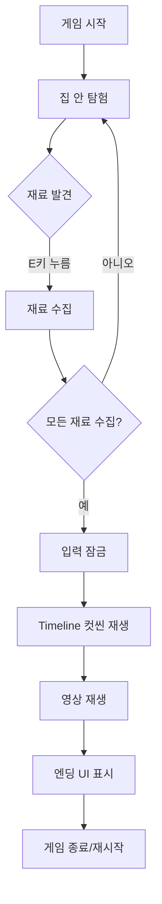

# Birthday Cake Quest

VRM 캐릭터로 집 안을 탐험하며 케이크 재료를 모으는 Unity 게임입니다. 모든 재료를 수집하면 Timeline 컷씬(영상 포함)이 재생되고 엔딩으로 마무리됩니다.

## ✨ 게임 특징

- **VRM 캐릭터**: UniVRM을 통해 VRM 모델을 플레이어로 사용
- **3/4 뷰 카메라**: Isometric 느낌의 고정 각도 카메라
- **수집 시스템**: 5가지 케이크 재료를 집 안에서 찾아 수집
- **체크리스트 UI**: 실시간으로 수집 진행 상황 표시
- **엔딩 컷씬**: Timeline과 VideoPlayer를 활용한 영상 재생

## 🎮 조작 방법

- **WASD**: 이동
- **Shift**: 달리기
- **E**: 재료 수집

## 🛠 요구 사항

### 필수
- **Unity 2022.3 LTS 이상** (2022.3.62f3 권장)
- **Universal Render Pipeline (URP)**
- **TextMeshPro**

### 권장
- **Cinemachine** (카메라 연출용, 선택)
- **Timeline** (컷씬용, 필수)

### 리소스
- VRM 캐릭터 파일 (.vrm)
- 집 3D 모델 또는 에셋
- 엔딩 영상 파일 (.mp4 등)

## 📦 설치 및 실행

### 1. 프로젝트 열기

```bash
# Unity Hub를 통해 프로젝트 열기
# Unity 버전: 2022.3.62f3 선택
```

**Access is denied 오류가 발생하는 경우**:
1. 프로젝트를 영문 경로로 이동 (예: `C:\UnityProjects\BirthdayCakeQuest\`)
2. Windows 보안 → 랜섬웨어 방지 → 제어된 폴더 액세스에서 Unity 허용
3. Unity Hub를 관리자 권한으로 실행

### 2. UniVRM 설치

자세한 내용은 [UniVRM 설치 가이드](Docs/UniVRM_Setup_Guide.md)를 참고하세요.

**간단 설치**:
1. https://github.com/vrm-c/UniVRM/releases 에서 최신 버전 다운로드
2. Unity에서 `Assets → Import Package → Custom Package`
3. 다운로드한 `.unitypackage` 파일 선택 후 Import

### 3. 한글 폰트 설정 (UI용)

자세한 내용은 [한글 폰트 설정 가이드](Docs/Korean_Font_Setup_Guide.md)를 참고하세요.

**빠른 설정**:
1. Noto Sans KR 폰트 다운로드 (Google Fonts)
2. `Assets/Fonts/` 폴더에 `.ttf` 파일 복사
3. `Window → TextMeshPro → Font Asset Creator`
4. Character Sequence: `20-7E AC00-D7A3 2713 25A1` (공백으로 구분, 쉼표 사용 시 공백 제거)
5. Atlas Resolution: `2048 x 2048`, Render Mode: `SDFAA`
6. Generate Font Atlas → Save
7. UI 텍스트의 Font Asset을 생성한 폰트로 변경

### 4. 씬 구성

자세한 내용은 [씬 구성 가이드](Docs/Scene_Setup_Guide.md)를 참고하세요.

**빠른 체크리스트**:
- [ ] Home.unity 씬 생성
- [ ] VRM 캐릭터를 Player로 설정
- [ ] CharacterController, PlayerController, Interactor 추가
- [ ] 카메라에 IsometricFollowCamera 추가
- [ ] 재료 오브젝트 5개 배치 (CollectibleIngredient 스크립트 포함)
- [ ] UI Canvas 및 IngredientChecklistUI 설정
- [ ] Timeline 컷씬 및 EndingCutsceneController 설정
- [ ] 모든 참조 연결

## 📁 프로젝트 구조

```
Assets/
├── Scenes/
│   └── Home.unity              # 메인 게임 씬
├── Scripts/
│   ├── Player/                 # 플레이어 이동 및 상호작용
│   │   ├── PlayerController.cs
│   │   └── Interactor.cs
│   ├── Ingredients/            # 재료 수집 시스템
│   │   ├── IngredientId.cs
│   │   ├── CollectibleIngredient.cs
│   │   └── IngredientInventory.cs
│   ├── Camera/                 # 카메라 추적
│   │   └── IsometricFollowCamera.cs
│   ├── UI/                     # UI 시스템
│   │   └── IngredientChecklistUI.cs
│   └── Cutscene/               # 컷씬 제어
│       └── EndingCutsceneController.cs
├── Prefabs/                    # 프리팹 보관
├── Video/                      # 엔딩 영상
├── Materials/                  # 머티리얼
└── VRM/                        # VRM 캐릭터 파일
```

## 🎯 게임 플레이 흐름



## 🧩 주요 컴포넌트

### PlayerController
- WASD 이동, Shift 달리기
- CharacterController 기반 물리 이동
- 입력 활성화/비활성화 기능 (컷씬용)

### Interactor
- 주변 재료 감지 (Physics.OverlapSphere)
- E키로 가장 가까운 재료 수집
- 상호작용 프롬프트 UI 제어

### IngredientInventory
- 싱글톤 패턴으로 전역 접근
- 수집된 재료 추적
- 이벤트: `OnIngredientCollected`, `OnAllCollected`

### IngredientChecklistUI
- TextMeshPro로 체크리스트 표시
- 실시간 수집 상태 업데이트
- 수집 완료 시 색상 변경

### EndingCutsceneController
- 모든 재료 수집 시 자동 트리거
- Timeline 재생 제어
- VideoPlayer 통합 (선택)
- 엔딩 UI 표시

### IsometricFollowCamera
- 3/4 뷰 고정 각도
- 부드러운 플레이어 추적
- 카메라 범위 제한 (선택)

## 🐛 문제 해결

### VideoPlayer 컴파일 에러

**증상**: `The type name 'VideoPlayer' could not be found`

**해결**:
1. Unity Editor 재시작
2. `Edit → Preferences → External Tools → Regenerate project files`
3. 스크립트 에디터 재시작

### VRM 임포트 실패 (Shader 에러)

**증상**: `ArgumentNullException: Value cannot be null. Parameter name: Shader`

**해결**:
- [VRM 임포트 문제 해결 가이드](Docs/VRM_Import_Troubleshooting.md) 참고
- UniVRM UnityPackage 재설치
- URP Asset 설정 확인 (ProjectSettings → Graphics)

### VRM 캐릭터가 분홍색

**해결**:
- 머티리얼 Shader를 `VRM/MToon` 또는 `VRM10/MToon10`으로 변경
- 또는 `Edit → Render Pipeline → URP → Upgrade Project Materials`

### 재료 수집이 안 됨

**체크리스트**:
- [ ] IngredientInventory가 씬에 있는지 확인
- [ ] 재료에 Collider가 있는지 확인
- [ ] Interactor의 Detection Radius 확인
- [ ] 재료의 Interaction Radius 확인

### 컷씬이 재생되지 않음

**체크리스트**:
- [ ] PlayableDirector에 Timeline Asset 할당 확인
- [ ] EndingCutsceneController의 모든 참조 연결 확인
- [ ] Console에서 에러 메시지 확인

### UI 한글이 □(네모)로 표시됨

**증상**: 체크리스트 UI에서 한글이 모두 네모로 표시됨

**해결**:
- [한글 폰트 설정 가이드](Docs/Korean_Font_Setup_Guide.md) 참고
- Noto Sans KR 등 한글 지원 폰트 다운로드
- TextMeshPro Font Asset Creator로 한글 폰트 생성
- UI 텍스트의 Font Asset을 생성한 폰트로 변경

## 📚 상세 문서

- [UniVRM 설치 가이드](Docs/UniVRM_Setup_Guide.md)
- [씬 구성 가이드](Docs/Scene_Setup_Guide.md)
- [VRM 임포트 문제 해결](Docs/VRM_Import_Troubleshooting.md)

## 🔧 커스터마이징

### 재료 개수 변경

`IngredientInventory.cs`에서:
```csharp
[SerializeField] private IngredientId[] requiredIngredients = new IngredientId[]
{
    IngredientId.Flour,
    IngredientId.Sugar,
    // 여기에 추가/제거
};
```

### 이동 속도 조정

Player 오브젝트의 `PlayerController` 컴포넌트에서:
- Walk Speed: 기본 이동 속도
- Run Speed: 달리기 속도
- Rotation Speed: 회전 속도

### 카메라 각도 변경

Main Camera의 `IsometricFollowCamera` 컴포넌트에서:
- Offset: 카메라 위치 오프셋
- Angle X: 카메라 각도 (45도 권장)
- Follow Speed: 추적 속도

## 📝 라이선스

이 프로젝트는 교육 및 개인 프로젝트용입니다.

## 🙏 크레딧

- **Unity Engine**: Unity Technologies
- **UniVRM**: VRM Consortium
- **TextMeshPro**: Unity Technologies

## 📮 지원

문제가 발생하면 다음을 확인하세요:
1. Unity 버전 확인 (2022.3 LTS)
2. Console 창의 에러 메시지
3. 모든 참조가 제대로 연결되었는지 확인
4. 상세 문서의 문제 해결 섹션 참고

---

**즐거운 개발 되세요!** 🎂✨

