# Birthday Cake Quest

VRM 캐릭터로 집 안을 탐험하며 케이크 재료를 모으는 Unity 게임입니다. 모든 재료를 수집하면 Timeline 컷씬(영상 포함)이 재생되고 엔딩으로 마무리됩니다.

## ✨ 게임 특징

- **VRM 캐릭터**: UniVRM을 통해 VRM 모델을 플레이어로 사용
- **아이소메트릭 3/4뷰 카메라**: 고정된 각도의 쿼터뷰 카메라
- **수집 시스템**: 5가지 케이크 재료를 집 안에서 찾아 수집
- **미니게임 시스템**: 재료별 고유한 미니게임 (설탕 따르기 등)
- **체크리스트 UI**: 실시간으로 수집 진행 상황 표시
- **문 상호작용**: E키로 열고 닫을 수 있는 문 + Floating UI 프롬프트
- **엔딩 컷씬**: Timeline과 VideoPlayer를 활용한 영상 재생

## 🎮 조작 방법

- **WASD**: 이동
- **Shift**: 달리기
- **E**: 재료 수집 / 문 열고 닫기
- **마우스/스페이스바**: 미니게임 플레이 (재료별 상이)

## 🛠 요구 사항

### 필수
- **Unity 2022.3 LTS 이상** (2022.3.62f3 권장)
- **Universal Render Pipeline (URP)**
- **TextMeshPro**

### 권장
- **Cinemachine** (카메라 연출용, 선택)
- **Timeline** (컷씬용, 필수)

### 리소스
- VRM 캐릭터 파일 (.vrm)
- 집 3D 모델 또는 에셋
- 엔딩 영상 파일 (.mp4 등)

## 📦 설치 및 실행

### 1. 프로젝트 열기

```bash
# Unity Hub를 통해 프로젝트 열기
# Unity 버전: 2022.3.62f3 선택
```

**Access is denied 오류가 발생하는 경우**:
1. 프로젝트를 영문 경로로 이동 (예: `C:\UnityProjects\BirthdayCakeQuest\`)
2. Windows 보안 → 랜섬웨어 방지 → 제어된 폴더 액세스에서 Unity 허용
3. Unity Hub를 관리자 권한으로 실행

### 2. UniVRM 설치

자세한 내용은 [UniVRM 설치 가이드](Docs/UniVRM_Setup_Guide.md)를 참고하세요.

**간단 설치**:
1. https://github.com/vrm-c/UniVRM/releases 에서 최신 버전 다운로드
2. Unity에서 `Assets → Import Package → Custom Package`
3. 다운로드한 `.unitypackage` 파일 선택 후 Import

### 3. 한글 폰트 설정 (UI용)

자세한 내용은 [한글 폰트 설정 가이드](Docs/Korean_Font_Setup_Guide.md)를 참고하세요.

**빠른 설정**:
1. Noto Sans KR 폰트 다운로드 (Google Fonts)
2. `Assets/Fonts/` 폴더에 `.ttf` 파일 복사
3. `Window → TextMeshPro → Font Asset Creator`
4. Character Sequence: `20-7E AC00-D7A3 2713 25A1` (공백으로 구분, 쉼표 사용 시 공백 제거)
5. Atlas Resolution: `2048 x 2048`, Render Mode: `SDFAA`
6. Generate Font Atlas → Save
7. UI 텍스트의 Font Asset을 생성한 폰트로 변경

### 4. 집 구조 자동 생성 (신규!)

**간단한 방법**: Unity Editor 메뉴 사용
```
1. Unity Editor 상단 메뉴:
   Tools → Birthday Cake Quest → Generate House + Ingredients

2. "생성" 클릭

3. 완료! 모든 방과 재료가 자동으로 배치됩니다.
```

자세한 내용은 [House Generator 가이드](Docs/House_Generator_Complete_Guide.md)를 참고하세요.

**생성되는 공간** (L자형 레이아웃):
- 입구 및 복도 (T자 구조)
- 침실1 (좌측)
- 침실+화장실 (앙스위트)
- 부엌/거실 (오픈 플랜, 10m x 6m)
- 침실2 (거실 오른쪽)
- 소파 & TV 자동 배치
- **하얀 대리석 바닥** (반짝반짝)

### 5. 씬 구성

자세한 내용은 [씬 구성 가이드](Docs/Scene_Setup_Guide.md)를 참고하세요.

**빠른 체크리스트**:
- [ ] Home.unity 씬 생성
- [ ] **[자동] House 생성** (Tools → Generate House + Ingredients)
- [ ] VRM 캐릭터를 Player로 설정
- [ ] CharacterController, PlayerController, Interactor 추가
- [ ] 카메라에 IsometricFollowCamera 추가
- [ ] **[자동] 재료 5개 자동 배치됨**
- [ ] UI Canvas 및 IngredientChecklistUI 설정
- [ ] Timeline 컷씬 및 EndingCutsceneController 설정
- [ ] 모든 참조 연결

## 📁 프로젝트 구조

```
Assets/
├── Scenes/
│   ├── TitleScene.unity        # 타이틀 화면
│   └── Home.unity              # 메인 게임 씬
├── Scripts/
│   ├── Player/                 # 플레이어 이동 및 상호작용
│   │   ├── PlayerController.cs
│   │   └── Interactor.cs
│   ├── Ingredients/            # 재료 수집 시스템
│   │   ├── IngredientId.cs
│   │   ├── CollectibleIngredient.cs
│   │   └── IngredientInventory.cs
│   ├── Camera/                 # 카메라 추적
│   │   └── IsometricFollowCamera.cs
│   ├── UI/                     # UI 시스템
│   │   ├── IngredientChecklistUI.cs
│   │   ├── TitleScreenUI.cs
│   │   └── CreditsScroller.cs
│   ├── Cutscene/               # 컷씬 제어
│   │   ├── EndingCutsceneController.cs
│   │   └── EndingSignalReceiver.cs
│   ├── Interaction/            # 상호작용 시스템
│   │   ├── IInteractable.cs
│   │   └── SofaInteractable.cs
│   ├── Props/                  # 소품/가구
│   │   ├── Door.cs
│   │   └── CakeHolder.cs
│   ├── Managers/               # 게임 매니저
│   │   └── SceneLoader.cs
│   └── Tools/                  # 에디터 도구
│       └── HouseGenerator.cs   # 집 자동 생성 도구 ✨
├── Editor/                     # Unity Editor 스크립트
│   └── HouseGeneratorEditor.cs # 집 생성 메뉴
├── Prefabs/                    # 프리팹 보관
│   ├── Ingredient_*.prefab     # 재료 프리팹들
│   └── Cake.prefab
├── Video/                      # 엔딩 영상
├── Materials/                  # 머티리얼
├── VRM/                        # VRM 캐릭터 파일
└── Docs/                       # 문서
    ├── UniVRM_Setup_Guide.md
    ├── Scene_Setup_Guide.md
    ├── Korean_Font_Setup_Guide.md
    ├── Ending_Cutscene_Setup_Guide.md
    └── House_Generator_Complete_Guide.md ✨
```

## 🎯 게임 플레이 흐름

```mermaid
graph TD
    A[게임 시작] --> B[집 안 탐험]
    B --> C{재료 발견}
    C -->|E키 누름| D[재료 수집]
    D --> E{모든 재료 수집?}
    E -->|아니오| B
    E -->|예| F[입력 잠금]
    F --> G[Timeline 컷씬 재생]
    G --> H[영상 재생]
    H --> I[엔딩 UI 표시]
    I --> J[게임 종료/재시작]
```



## 🧩 주요 컴포넌트

### PlayerController
- WASD 이동, Shift 달리기
- CharacterController 기반 물리 이동
- 입력 활성화/비활성화 기능 (컷씬용)

### Interactor
- 주변 재료 감지 (Physics.OverlapSphere)
- E키로 가장 가까운 재료 수집
- 상호작용 프롬프트 UI 제어

### IngredientInventory
- 싱글톤 패턴으로 전역 접근
- 수집된 재료 추적
- 이벤트: `OnIngredientCollected`, `OnAllCollected`

### IngredientChecklistUI
- TextMeshPro로 체크리스트 표시
- 실시간 수집 상태 업데이트
- 수집 완료 시 색상 변경

### EndingCutsceneController
- 모든 재료 수집 시 자동 트리거
- Timeline 재생 제어
- VideoPlayer 통합 (선택)
- 엔딩 UI 표시

### IsometricFollowCamera
- 3/4 뷰 고정 각도
- 부드러운 플레이어 추적
- 카메라 범위 제한 (선택)

## 🐛 문제 해결

### VideoPlayer 컴파일 에러

**증상**: `The type name 'VideoPlayer' could not be found`

**해결**:
1. Unity Editor 재시작
2. `Edit → Preferences → External Tools → Regenerate project files`
3. 스크립트 에디터 재시작

### VRM 임포트 실패 (Shader 에러)

**증상**: `ArgumentNullException: Value cannot be null. Parameter name: Shader`

**해결**:
- [VRM 임포트 문제 해결 가이드](Docs/VRM_Import_Troubleshooting.md) 참고
- UniVRM UnityPackage 재설치
- URP Asset 설정 확인 (ProjectSettings → Graphics)

### VRM 캐릭터가 분홍색

**해결**:
- 머티리얼 Shader를 `VRM/MToon` 또는 `VRM10/MToon10`으로 변경
- 또는 `Edit → Render Pipeline → URP → Upgrade Project Materials`

### 재료 수집이 안 됨

**체크리스트**:
- [ ] IngredientInventory가 씬에 있는지 확인
- [ ] 재료에 Collider가 있는지 확인
- [ ] Interactor의 Detection Radius 확인
- [ ] 재료의 Interaction Radius 확인

### 컷씬이 재생되지 않음

**체크리스트**:
- [ ] PlayableDirector에 Timeline Asset 할당 확인
- [ ] EndingCutsceneController의 모든 참조 연결 확인
- [ ] Console에서 에러 메시지 확인

### E키를 눌러도 문이 안 열림 / 재료를 수집할 수 없음

**체크리스트**:
- [ ] 문/재료 GameObject의 Layer가 "Interactable"인지 확인
- [ ] BoxCollider가 있고 Is Trigger가 체크되어 있는지 확인
- [ ] Door/CollectibleIngredient 스크립트가 추가되어 있는지 확인
- [ ] Player에 Interactor 컴포넌트가 있는지 확인
- [ ] Console 창에서 디버그 로그 확인

**자세한 해결 방법**: 
- [상호작용 문제 해결 가이드](Docs/Troubleshooting_Interaction.md) - **이슈 진단 및 해결**
- [문 상호작용 가이드](Docs/Door_Interaction_Guide.md)

### UI 한글이 □(네모)로 표시됨

**증상**: 체크리스트 UI에서 한글이 모두 네모로 표시됨

**해결**:
- [한글 폰트 설정 가이드](Docs/Korean_Font_Setup_Guide.md) 참고
- Noto Sans KR 등 한글 지원 폰트 다운로드
- TextMeshPro Font Asset Creator로 한글 폰트 생성
- UI 텍스트의 Font Asset을 생성한 폰트로 변경

## 📚 상세 문서

- [UniVRM 설치 가이드](Docs/UniVRM_Setup_Guide.md) - VRM 모델 임포트 방법
- [씬 구성 가이드](Docs/Scene_Setup_Guide.md) - 게임 씬 설정 가이드
- [한글 폰트 설정 가이드](Docs/Korean_Font_Setup_Guide.md) - TextMeshPro 한글 폰트 설정
- [엔딩 컷씬 설정 가이드](Docs/Ending_Cutscene_Setup_Guide.md) - Timeline/영상 재생 설정
- **[House Generator 가이드](Docs/House_Generator_Complete_Guide.md)** ✨ - 집 자동 생성 도구
- **[문 상호작용 가이드](Docs/Door_Interaction_Guide.md)** 🚪 - E키로 문 열고 닫기
- **[미니게임 시스템 가이드](Docs/MiniGame_Setup_Guide.md)** 🎮 - 재료별 미니게임 설정
- **[미니게임 Unity 설정](Docs/MiniGame_Unity_Setup.md)** 🎨 - Unity Editor에서 미니게임 UI 설정
- **[상호작용 문제 해결 가이드](Docs/Troubleshooting_Interaction.md)** 🔧 - 상호작용 오류 진단 및 해결

## 🔧 커스터마이징

### 재료 개수 변경

`IngredientInventory.cs`에서:
```csharp
[SerializeField] private IngredientId[] requiredIngredients = new IngredientId[]
{
    IngredientId.Flour,
    IngredientId.Sugar,
    // 여기에 추가/제거
};
```

### 이동 속도 조정

Player 오브젝트의 `PlayerController` 컴포넌트에서:
- Walk Speed: 기본 이동 속도
- Run Speed: 달리기 속도
- Rotation Speed: 회전 속도

### 카메라 각도 변경

Main Camera의 `IsometricFollowCamera` 컴포넌트에서:
- Offset: 카메라 위치 오프셋
- Angle X: 카메라 각도 (45도 권장)
- Follow Speed: 추적 속도

## 📝 라이선스

이 프로젝트는 교육 및 개인 프로젝트용입니다.

## 🙏 크레딧

- **Unity Engine**: Unity Technologies
- **UniVRM**: VRM Consortium
- **TextMeshPro**: Unity Technologies

## 📮 지원

문제가 발생하면 다음을 확인하세요:
1. Unity 버전 확인 (2022.3 LTS)
2. Console 창의 에러 메시지
3. 모든 참조가 제대로 연결되었는지 확인
4. 상세 문서의 문제 해결 섹션 참고

---

**즐거운 개발 되세요!** 🎂✨

